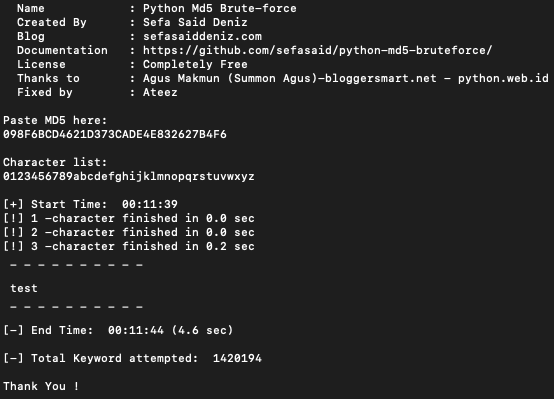

# Python MD5 [FAST] Bruteforce

## Switchable (Cyrillic) Russian letters

You can uncomment lines for full bruteforce or/and add **(Cyrillic) russian** letters


## Installation

Clone repo from my github page

## How To Run

```sh
python md5-bruteforce.py
```

after script says

```sh
Paste MD5 here:
```

paste your md5 string and hit enter

## Version

2.1


## Test



## License

Completely Free

**Free Software, Hell Yeah!**

 Thanks to       :  Sefa Deniz (<https://github.com/sefasaid>)
 
 Also thanks to  :  Sefa Deniz (<https://github.com/rzumstein>)

